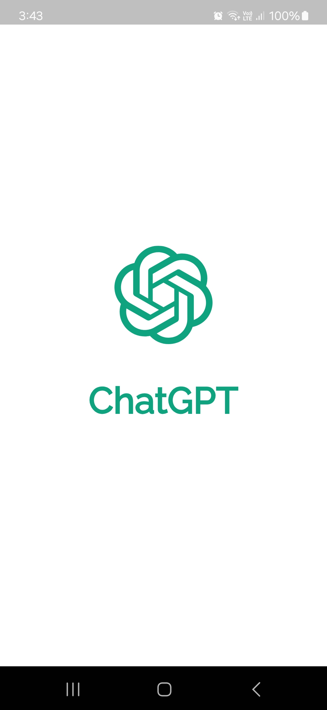

•  Chat GPT App using API
Welcome to ChatGPT Companion, your personal conversational assistant powered by state-of-the-art AI. With ChatGPT Companion,
you can engage in natural and meaningful conversations on a wide range of topics, whether you need assistance, want to brainstorm ideas
, or simply seek friendly conversation.

• Features:

o  Seamless Conversations: ChatGPT Companion provides a smooth and natural conversational experience, allowing you to interact just like you would with a human.

o  AI-Powered Assistance: Harnessing the power of the ChatGPT model, our app offers intelligent responses and suggestions tailored to your queries and preferences.

o  Versatility: From casual chatting to deep discussions, ChatGPT Companion adapts to your needs, making it the perfect companion for various scenarios.

o  Personalization: Over time, ChatGPT Companion learns from your interactions, getting to know you better and providing more personalized responses.

o  24/7 Availability: Whether it's day or night, ChatGPT Companion is always ready to chat, providing round-the-clock assistance whenever you need it.

• Screenshots

Here are some screenshots of the app:

o Splash Screen

 It is an initial screen that appears for a number of seconds.

 W(assets/images/r7.jpg)

• Setup

To run this app on your local machine, follow these steps:

1- Clone this repository using the command git clone https://github.com/MohamedFouad99/chat_gpt.git

2- Add Your API Key.

3- Run flutter pub get to install the necessary dependencies.

4- Run the app using flutter run.

• Dependencies

 o flutter_svg: ^2.0.10+1
 
 
 o get: ^4.6.5
 
 
 o get_storage: ^2.1.1
 
 
 o flutter_spinkit: ^5.1.0
 
 
 o http: ^1.0.0
 
 
 o provider: ^6.0.5
 
 
 o animated_text_kit: ^4.2.2
 

 
 

• Contributions

Contributions to this project are welcome! 

If you find any issues or have suggestions for new features, please open an issue or a pull request.
